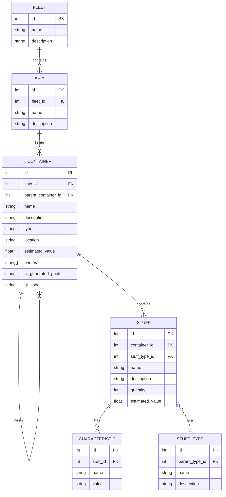

# Catalogai

An open-source tool for cataloging box contents. Upload photos of items in a box, and the tool generates a text-based inventory for easy tracking and printing—perfect for organizing during moves or asset management.

## Motivation

The Redwood Experiments: Volume 1.

The goals of this project are technical. The first is to explore writing code with an LLM+Agents, and the second is to restrict this to React Server Components. This will be contrasted by another app which will exploring building software using local first principles.

## Concepts

### Container

Everything is a "container". contAIner -- get it? AI?

A container is a collection of items. It's possible to nest containers, so a container can contain other containers.

It is a box, drawer, cabinet, room, shelf, or any other thing that can hold items ... or stuff.

- photos(s)
- ai generated photo of all stuff in container
- text description of all stuff in container
- list of all stuff in container
- tags
- estimated value
- location
- history

### Stuff

Containers have stuff.

Stuff has categories and types like "shirt" or "pants" or "cutely" or "book" or "toy" or "cds".

Stuff categories can be parent and child relations so "music" can also be "cd" or "cassette" or "lp" but also "jazz" or "rock" or "pop" or even "instrument". And "instrument" could be "guitar" or "piano" or "drums" etc.

Stuff is generic, but also yous. So there is a "fork" stuff record and if your container is a drawer and has forks then your container has 4 relations to the general fork stuff record.

That way we can report and count how many forks people have.

### Characteristics

Characteristics are properties of stuff.

Characteristics are like tags but they are more specific.

For example a "shirt" could have a characteristic of "size" with values "small", "medium", "large" etc.

The could be color, weight, volume, etc. Like a "dress shirt" could be "large" and "blue" and "cotton" and "formal".

Characteristics can also be generic. So you could have a "size" characteristic for "shirts" and "pants" and "shoes" etc.

### Inventory

The inventory is a list of all the stuff in a container, and the containers that contain them.

### Label

QR codes are printed on labels and attached to the containers. When the inventory is downloaded as a PDF, the QR codes are converted to text so they can be scanned and edited.

### Physical vs Virtual containers

Physical containers are real objects that can be touched. Virtual containers are not real objects, but they can be used to organize and track stuff.

We can use Ai to automatically organize stuff into logical virtual containers.

For example you may have 3 boxes and in those boxes you have some stuff -- some toys.

We can automatically create a virtual container of just your toys. This way we can inventory and even assign monetary value estimates for each and ll your toys.

### The Metaphor

A container ship. It's moving your stuff from one place to another.

The container ship is you. It's your stuff. It's your life. Or maybe you have a fleet. All your ships is all your stuff.

Container ships are often named "Global Pioneer" or "Blue Horizon" or "Aqua Voyager" etc. We can automatically generate names for your containers based on there rules using LLMs with adjective and noun arrays.

Maybe the app is named something ship or fleet related like ... ?

### Mascot

## Usage

The homepage displays a list of collections. Each collection contains photos that are automatically converted into a text-based inventory. Users can download a PDF of the inventory along with a QR code to label the box. Scanning the QR code allows users to access and edit the collection.

## Technical details

The technical stack is:

- [Vite](https://vitejs.dev)
- [Prisma](https://www.prisma.io) + SQLite ([Turso](https://turso.tech)? [libSQL](https://github.com/tursodatabase/libsql)?)
- React Server Components
- [TailwindCss](https://tailwindcss.com)
- [Shadcn UI](https://ui.shadcn.com)
- [fal.ai](https://fal.ai) for generative ai (images, image to text)
- [Langbase](https://langbase.com) for AI pipes

Opinionated technical choices:

- We will not bundle or build for production.
- We will not use S3.
- No user accounts

## Diagrams

> NOTE
> This was an attempt at an AI-generated ERD. It is not perfect.
>
> This model is inadequate if we want stuff to be generic and also personal.
> Meaning, a stuff of "fork" for you might be "metal" and "ornate" but for someone else it is "plastic" and "simple". We both have forks, but they are different.
>
> Also, quantity might be derived from the count of stuff with the same stuff type and characteristics.

## Entity Relationships

- **FLEET**: Represents the top-level organization of a user's belongings.

  - Has a one-to-many relationship with SHIP.

- **SHIP**: Represents a collection of containers, following the container ship metaphor.

  - Belongs to a FLEET.
  - Has a one-to-many relationship with CONTAINER.

- **CONTAINER**: Represents physical or virtual containers that hold stuff.

  - Belongs to a SHIP.
  - Can nest other CONTAINERS (self-referential relationship).
  - Has a one-to-many relationship with STUFF.

- **STUFF**: Represents individual items within containers.

  - Belongs to a CONTAINER.
  - Has a many-to-one relationship with STUFF_TYPE.
  - Has a one-to-many relationship with CHARACTERISTIC.

- **STUFF_TYPE**: Represents categories and types of stuff.

  - Has a self-referential relationship for parent-child categories.

- **CHARACTERISTIC**: Represents properties of stuff items.
  - Belongs to a STUFF item.

This model allows for the hierarchical organization of items (Fleet > Ship > Container > Stuff) while also supporting nested containers, categorization of items, and flexible characteristics for each item.
